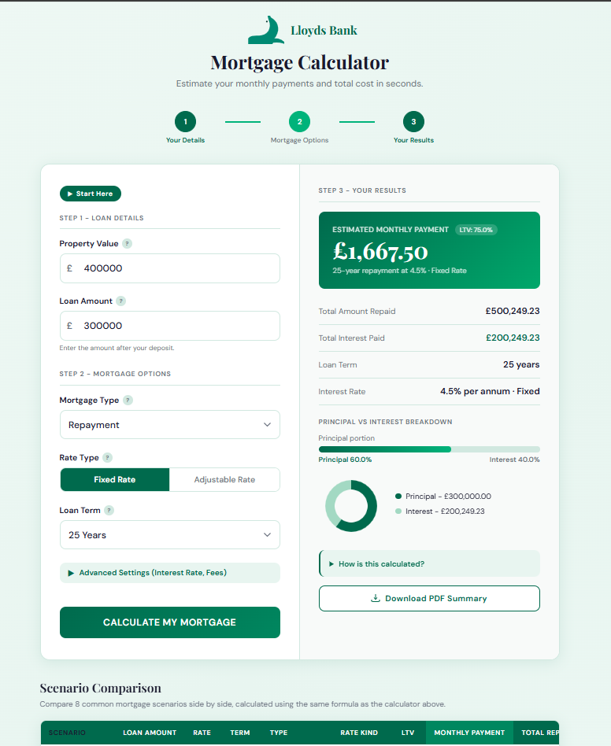
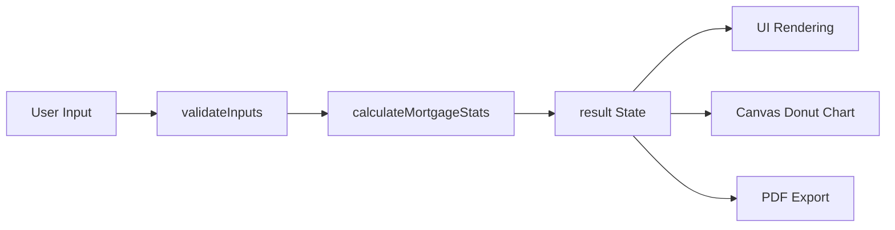

# 🏠 Lloyds Mortgage Calculator

A production-ready React application built to simulate professional financial systems. This project focuses on clean architecture, modular logic separation, input validation, data visualization, and automated deployment pipelines.

[](https://reactjs.org/)
[](https://azure.microsoft.com/)
[](https://github.com/features/actions)
[](https://parall.ax/products/jspdf)

> **⚠️ Deployment Notice:** Azure deployment is currently paused as the free tier limit has been reached. The CI/CD pipeline remains intact, and I am currently exploring free-tier alternatives (Railway, Render, Vercel) for redeployment. 

**🔗 Live Demo:** [View Application (Currently Paused)](https://llyodbanking-mortgage-calculator-h0gmadcfh0bvb3eh.westeurope-01.azurewebsites.net/) 
**📄 Certification:** [View Lloyds Banking Group Technology Engineering Job Simulation Certificate](docs/Lloyd-Banking-Group-Technology-Engineering-Job-Simulation.pdf)

---
  
## 📸 Previews



---

## 🚀 Overview

Developed as part of the **Lloyds Banking Group Technology Engineering Job Simulation** on Forage. This application models a real-world mortgage estimation tool with a focus on validated financial logic, visual data output, and PDF export — ensuring it functions as a reliable system, not just a UI exercise.

**Key User Features:**
* Estimate monthly mortgage payments (repayment or interest-only).
* Analyze total interest and principal breakdown over the loan term.
* Compare multiple loan scenarios side-by-side.
* Export a branded PDF summary of the mortgage estimate.

---

## ✨ Core Functionalities

* **Form State Management & Input Handling:** Every input field is managed via React `useState`. A `toNumber` helper safely converts raw string inputs to numbers, preventing silent calculation errors.
* **Input Validation:** A `validateInputs` function checks parsed values against a `LIMITS` constant for minimum and maximum bounds, dynamically driving UI error warnings.
* **Calculation Processing:** Triggered by validation, sanitized inputs are passed to a `calculateMortgageStats` utility, simulating a network delay before revealing the output panel.
* **Dynamic Data Visualization:** Uses the HTML5 `<canvas>` API via a `useEffect` hook to programmatically draw a donut chart reflecting the principal-to-interest ratio, paired with a dynamically sizing horizontal CSS bar.
* **PDF Generation & Export:** Dynamically imports `jspdf` to programmatically draw colored rectangles, text, and lines at exact X/Y coordinates, producing a branded downloadable summary.
* **Interactive UI Components:** Includes an index-controlled FAQ accordion, boolean-toggled advanced settings, and localized currency formatting (`Intl.NumberFormat`).

---

## 🏗️ Project Architecture

### Three-Layer Structure

**1. Deployment & Build Layer**
* GitHub Actions CI/CD pipeline.
* Configured to auto-deploy to Azure App Service (West Europe) on every push to `main`.
* Optimized production build via `npm run build`.

**2. Product Structure Layer**
```text
public/         → index.html entry point
src/
  components/   → UI components
  utils/        → Financial logic (calculateMortgageStats, validateInputs, formatCurrency)
  styles/       → Styling files
```

**3. Core Logic Flow**


---

## 🛠️ Installation & Setup

**Clone the Repository**
```bash
git clone [https://github.com/Ahtesham-Latif/LLyods-Banking-Group-lloyds-mortgage-calculator.git](https://github.com/Ahtesham-Latif/LLyods-Banking-Group-lloyds-mortgage-calculator.git)
cd LLyods-Banking-Group-lloyds-mortgage-calculator
```

**Install Dependencies & Run**
```bash
npm install
npm start
```

**Run Tests**
```bash
npm test
```

---

## 🚀 Deployment

The project is configured for automated deployment via **GitHub Actions** to **Azure App Service (West Europe)** on every push to the `main` branch. No manual deployment steps are required after merging.

---

## 📄 License

Open-source under the **MIT License**.

---

## 👨‍💻 Author

**Ahtesham Latif**
*Technology Engineering Job Simulation — Lloyds Banking Group (Forage)*
[GitHub](https://github.com/Ahtesham-Latif) · [LinkedIn](https://www.linkedin.com/in/ahtesham-latif)